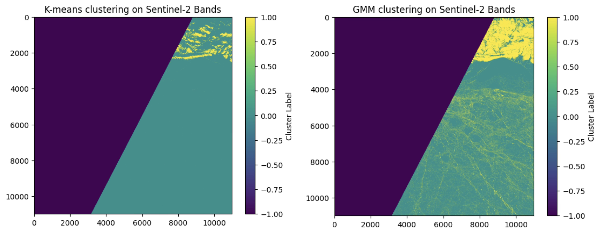
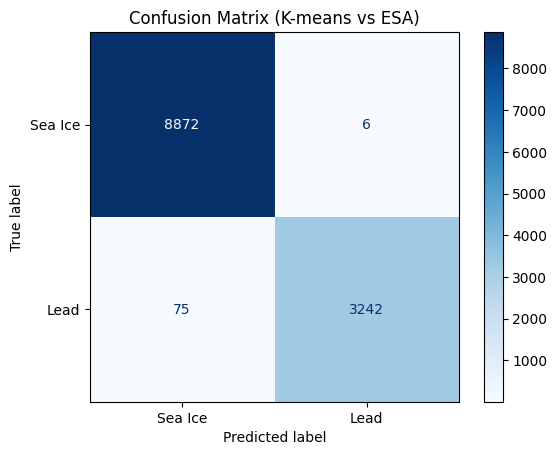

# Unsupervised Learning for Sea Ice and Lead Classification

**GEOL0069 (UCL Earth Sciences) — Week 4 Coursework**

This project applies **unsupervised learning** to classify **sea ice and leads** using Earth Observation data:
- **Sentinel-2** optical imagery (RGB bands)
- **Sentinel-3** altimetry waveforms

Clustering methods used:
- **K-means**
- **Gaussian Mixture Models (GMM)**

---

## Key Results

  

  <em>Comparison of K-means and GMM clustering applied to Sentinel-2 RGB bands.</em>

### 1. Waveform Alignment

#### GMM – Cluster Alignment

  

#### K-means – Cluster Alignment

  

---

### 2. Mean Echo Shape and Variability

#### GMM

  

#### K-means

  

---

### 3. Quantitative Evaluation (Confusion Matrices)

#### GMM vs ESA

  

#### K-means vs ESA

  

---

## Open the Notebook in Colab

---

## Repository

- [GitHub Repository](https://github.com/JAE-G23/unsupervised-learning)
- [Full documentation and methods (README)](../README.md)
